# GV-VAD

This repository contains the official implementation of our paper:
[**GV-VAD: Exploring Video Generation for Weakly-Supervised Video Anomaly Detection**](https://arxiv.org).

---

## 🔥 What's New

* 🚀 We introduce **GV-VAD**, a novel framework utilizing **text-conditioned video generation** to significantly augment weakly-supervised video anomaly detection datasets.
* 🎞️ Our approach generates semantically controllable and physically plausible synthetic videos, effectively mitigating the scarcity and high annotation costs associated with real-world anomalies.
* ⚙️ We employ a **synthetic sample loss scaling strategy** to manage the influence of synthetic samples during training, enhancing model efficiency and performance.
* 📈 GV-VAD achieves competitive results on the widely-used **UCF-Crime** dataset.
* 📦 The code, pre-trained models, and processed data will be available for full reproducibility.

---

## 💎 Framework


GV-VAD comprises two integral components:

1.	Video Generator
A conditional diffusion model that generates realistic anomalous and normal videos from structured textual descriptions. These descriptions encompass key anomaly-related elements: camera viewpoint, location, subject, and anomalous event, enabling diverse synthetic video generation to address real-world data scarcity.

2.	Synthetic Sample Loss Scaling (SSLS)
A loss scaling strategy designed to balance the influence of synthetic and real video samples during training. SSLS prevents model overfitting to synthetic data, ensuring robust anomaly detection performance on real-world videos.

A fusion mechanism integrates generated synthetic videos with real video samples to enhance the model’s ability to detect and generalize across various anomaly scenarios effectively.

---

## 🎥 Generated Video Samples

<p align="center">
  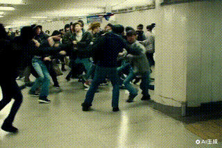
  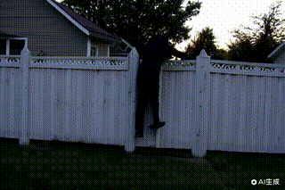
  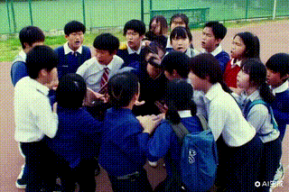
  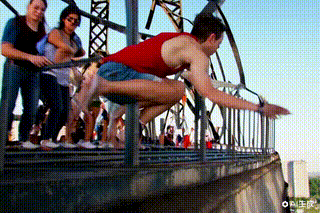
</p>

<p align="center">
  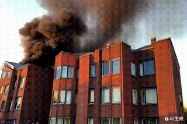
  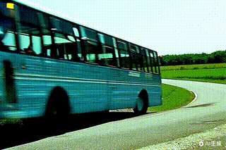
  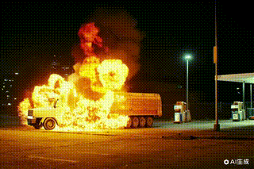
  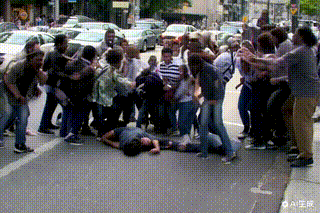
</p>

<p align="center">
  
  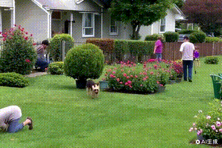
  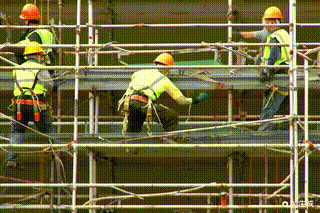
  
</p>

<p align="center">
  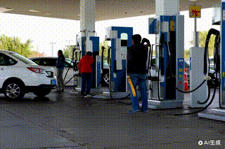
  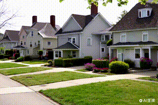
  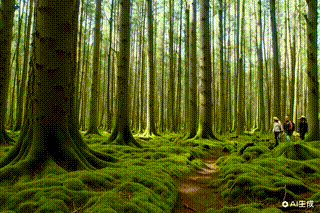
  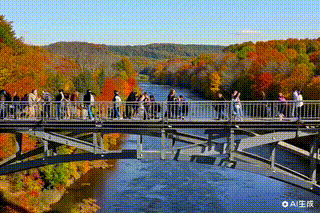
</p>


---

## 🏁 Quick Start

### 📁 Dataset Preparation

GV-VAD is evaluated on the **UCF-Crime** dataset.

Download the dataset from [UCF-Crime](https://www.crcv.ucf.edu/research/real-world-anomaly-detection-in-surveillance-videos/).

Please extract video features using CLIP as guided in the provided script:

```bash
python tools/extract_features.py --dataset ucfcrime --feature_extractor clip
```

---

### 🛠️ Environment Setup

Set up the Python environment using `conda`:

```bash
conda create -n gvvad python=3.8
conda activate gvvad
pip install -r requirements.txt
```

---

## 🚀 Training

To train GV-VAD:

```bash
python main_difLR.py --seed 3407 --feat_extractor clip --dataset ucfg2 --feature-size 768 --batch-size 32  --rgb_list list/GV-CLIP-L/ucfg2-clip.list --test_rgb_list list/GV-CLIP-L/ucf-clip-test.list --feature-group both --fusion concat --emb_folder sent_emb_n --emb_dim 768 --aggregate_text --extra_loss --use_dic_gt  --VLR 1 --Learnable_VLR --exp-name ucfg2-CLIP_L-VLR1L-seed3407
```

For related ablation experiments and more running configurations, please refer to `runGV.sh` and `option_difLR.py`

---

<!-- ## 🔍 Inference

Run inference with the trained model:

```bash
python infer.py --ckpt_path checkpoints/gvvad_ucf_best.pth --dataset ucfcrime
```

--- -->


## 📊 Evaluation

Evaluate anomaly detection performance (AUC):

```bash
python main_test.py
```

---

<!-- ## 🎯 Performance

| Dataset   | AUC (%) |
| --------- | ------- |
| UCF-Crime | 79.8    |
| UCF-Crime | 79.8    | -->

<!-- Qualitative results:


--- -->

## 💖 Acknowledgements

We sincerely thank the contributors of [LAP](https://arxiv.org/html/2403.01169) and prior works in the field of video anomaly detection for their invaluable resources and inspiration.

---

## 📚 Citation

If you find GV-VAD useful for your research, please cite our paper:

```bibtex
@article{cai2025gvvad,
  title={GV-VAD: Exploring Video Generation for Weakly-Supervised Video Anomaly Detection},
  author={Suhang Cai, Chong Wang, Xiaojie Cai, and Xiaohao Peng},
  journal={arXiv preprint arXiv:2403.01169},
  year={2025}
}
```
